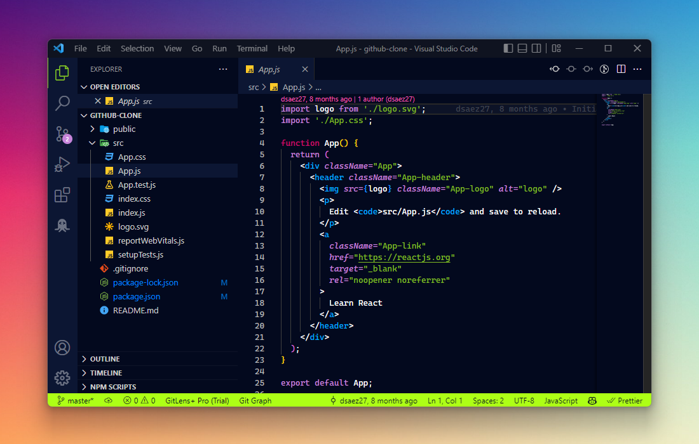

# Revellion Theme for Visual Studio Code

Revellion Theme is a modern dark color theme for Visual Studio Code designed to provide a pleasant and attractive development experience.

## Screenshots



## Color Palette

| Element | Hex | Description |
| ------- | --- | ----------- |
| Background | `#03091e` | Default background for editor and panels |
| UI Foreground | `#ececec` | General interface text color |
| Text Foreground | `#ffffff` | Main text color in the editor |
| Primary Accent | `#81be24` | Used for active elements like the status bar |
| Secondary Accent | `#c785db` | Highlight color for badges and accents |
| Selection Background | `#264f78` | Color for selected text |

## Installation

1. Open Visual Studio Code.
2. Go to the extensions view (Ctrl + Shift + X).
3. Search for "Revellion Theme".
4. Install it.
5. Select "Revellion Theme" from the theme palette (Ctrl + K, Ctrl + T).

## Features

- **Modern Design:** Vibrant colors and carefully selected contrasts for an enjoyable coding experience.
- **Readability:** The color palette is designed to improve code readability.
- **Compatibility:** Works with a wide range of languages and technologies.

## Configuration

You can customize some aspects of the theme by editing your `settings.json` file:

```json
{
  "workbench.colorTheme": "Revellion Theme",
  // Add any additional configuration here
}
```

## Issues and Contributions
If you find any problems or have suggestions to improve the theme, feel free to open an issue or contribute. I'm open to ideas and collaborations!

## License
This theme is licensed under the MIT License.

I hope you enjoy using Revellion Theme! If you like it, feel free to leave a ⭐️ on the repository.

<div align="center">
Made with ❤️ by dsaez27
</div>

